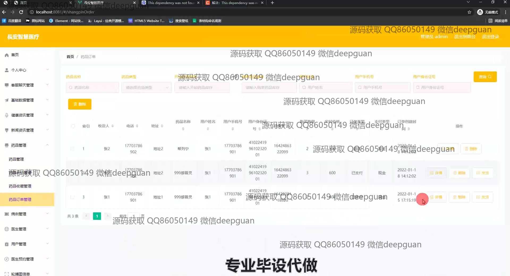
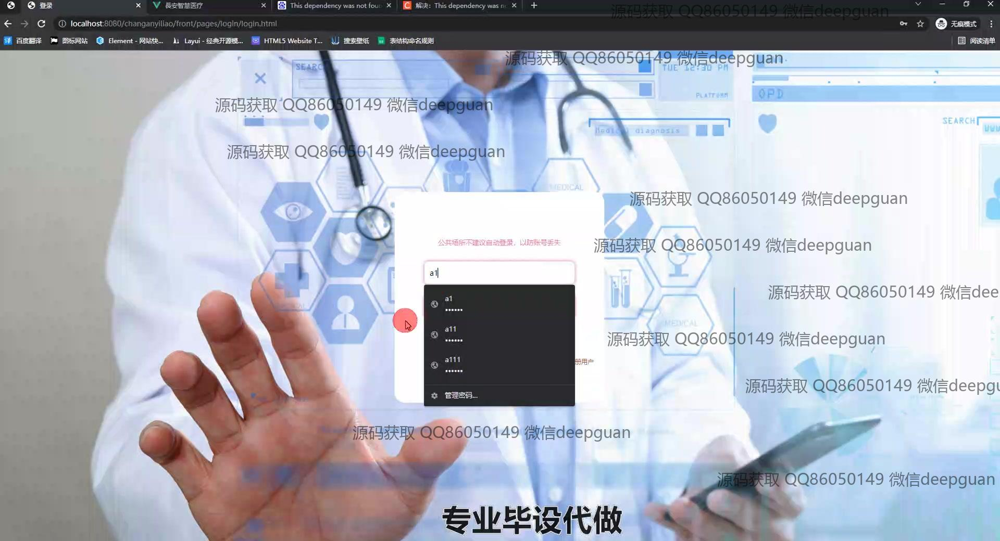

<h1 align="center">基于javaWeb的長安智慧医疗管理系统设计与实现+vue</h1>

## 简介
长安智慧医疗管理系统：角色分为管理员、医生、用户；功能涵盖用户管理、医生管理、药品管理、订单管理、健康资讯管理、医生预约管理。系统提供便捷的信息管理和高效的医疗资源配置。    --计算机毕业设计源码；毕设源码；java毕业设计源码

## 联系方式

<h3 align="center">获取完整代码与数据库文件 + 微信：deepguan QQ: 86050149 QQ群: 783742310</h3>

<h3 align="center">可帮忙远程部署 包运行成功！提供远程部署、修改代码、设计文档指导、代码讲解等服务！</h3>

## 功能介绍（完整见运行截图）
管理员：管理员通过登录、注册和安全退出功能访问系统。首页提供健康资讯、医生管理、药品管理等核心模块的导航，支持数据管理和系统监控。功能菜单允许管理员管理基础数据、药品订单、医生信息，并进行预约管理和信息资讯发布。药方管理、病例管理与轮播图设置等专项功能，提供高效医疗信息更新和药品库存控制。后台管理界面支持权限配置和用户跟踪，以确保数据准确性和系统安全。

医生：医生通过专用登录入口访问系统，管理个人工作记录和患者信息。医生模块提供预约管理、患者病历编辑及药方开具功能，允许医生查看患者健康资讯与医学新闻，便于掌握实时医疗动态。医生可通过系统与患者进行直接互动，获取患者计划信息和药品配送状态，增强日常工作效率。系统提供的患者档案管理和病例记录功能，助力医生进行精准诊疗和长期健康跟踪。

用户：用户可通过界面直观的登录和注册体验进入系统，访问健康资讯、药品信息以及新闻服务等功能模块。个人中心为用户提供健康资料管理、医生预约、订单跟踪和地址维护。用户可查看药品目录并通过在线订单管理功能进行药品和健康产品购买，支持订单查询和退款申请。健康资讯模块为用户提供最新医疗新闻和健康知识，支持个性化信息推送和用户需求定制。

访客：访客可以在登录界面了解系统概况以及进行用户注册，适用于潜在用户和新注册用户。登录页面提供医疗主题资讯，让访客熟悉系统的设计背景和典型功能。访客可以在包含专业医疗元素的界面上完成简单注册流程后获得系统访问权，开始试用或使用系统的基础功能。注册后，访客能利用系统提供的健康和药品相关资讯提升其医疗管理能力和健康水平。

## 运行截图

本代码来源于网络,仅供学习参考使用!

